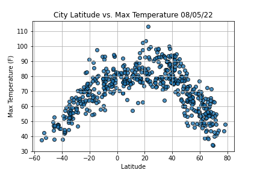

# World Weather Analysis
  
### Goal : Help travelers find their ideal vacation spot.  
  
## Overview Scenario  
PLANMYTRIP is a top travel technology company that specializes in internet related services in the hotel and lodging industry.  
Jack, the head of analysis for the user interface team, has asked me to help
him collect and present data for customers via the search page.  
The search page will be filtered based on their preferred travel criteria in order
to find their ideal hotel anywhere.  

## Skills  
- Using Jupyter notebook and the **CityPy** module to get the cities for more than 500 random latitutdes and longitudes.    
    
  
- Map cities and itineraries using **Jupyter GMaps** and the **Google Places API**.    
 
   
  
- Preform requests on the **OpenWeatherMap API** and retrieve current weather data.    
  
    
  
- Add weather data to a **Pandas** dataframe, and use **Matplotlib** to create a series of scatterplots to show the relationship between the latitude and a variety of weather parameters for over 500 cities around the globe.    
  
    
  
- Perform statistical calculations on data.  
- Using **linear regression** on weather paramters in the Northern and Southern hemispheres. 

## Purpose  
- This data will help the team predict the best places year for people to plan their vacations.  
- Shows the correlations between geographical location and different weather conditions.  
